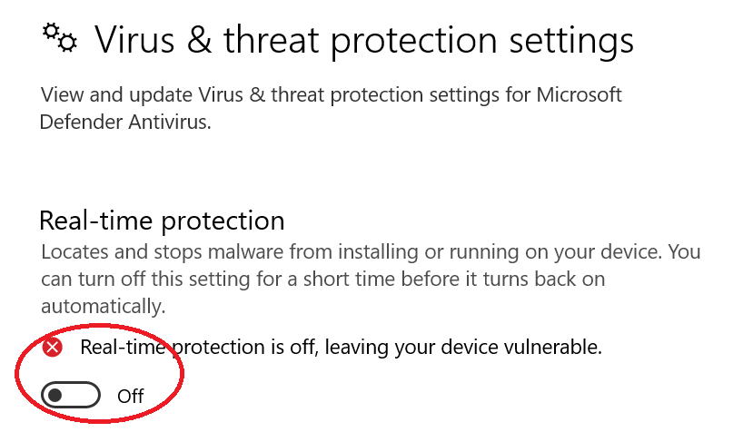

# DLL-Injection
For educational purposes !
This project was made as part of my solution to Magshimim's Architecture final Windows Project.

______________________________________________________________________________________________________________

## Notes Before Usage
In order to use this you have to disable the Windows Defender

______________________________________________________________________________________________________________

## Find PID Of Process
### SysInternals Process Explorer [procexp.exe]

### Task Manager [Taskmgr.exe]

______________________________________________________________________________________________________________

## Solutions Build & Run Order
1. WindowForDLL 
2. GavriDLL
3. Inject DLL